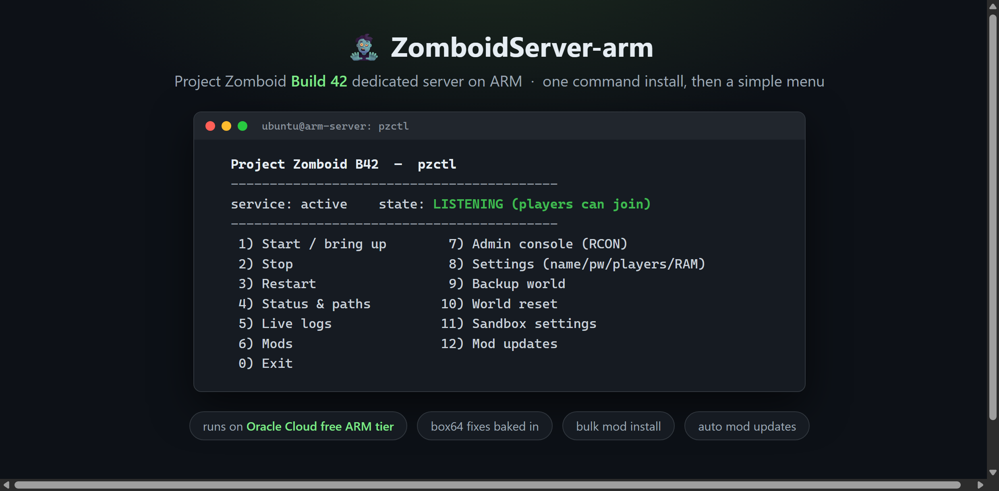
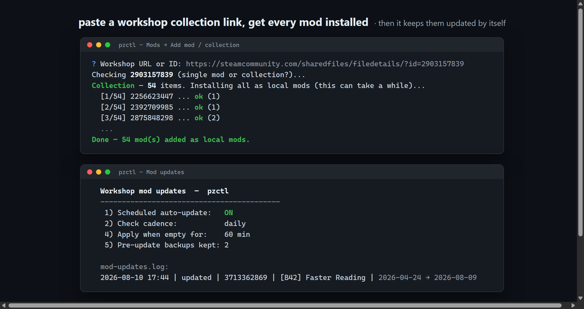

# 🧟 ZomboidServer-arm — Project Zomboid B42 server on ARM, the easy way

Run a **modded Project Zomboid Build 42** dedicated server on a cheap (or **free**) **ARM64**
box, like an **Oracle Cloud Ampere** VM, with **one command**. Then manage everything from a
terminal menu: mods, automatic mod updates, backups, world resets, an admin console.

This fork defaults to a pinned **FEX** runtime for the tested Oracle Ampere setup, while
retaining the original Box64 path as a fallback. See the complete tested hardware/software
reference in [`docs/oracle-a1-fex-reference.md`](docs/oracle-a1-fex-reference.md).

> **Why ARM / emulation?** The PZ server is x86-only. The tested ARM64 path uses pinned
> [FEX](https://fex-emu.github.io/) emulation; [box64](https://github.com/ptitSeb/box64)
> remains available as a fallback. The classic roadblock, `steamcmd` (32-bit x86,
> effectively broken on ARM), is not used at all: server files and mods come through
> **DepotDownloader**, which runs natively on ARM64.



---

## 🚀 Quick start

On a fresh **Ubuntu 22.04/24.04 (ARM64)** server:

```bash
git clone https://github.com/kaanzapkinus/ZomboidServer-arm.git
cd ZomboidServer-arm
sudo ./install.sh
```

Answer a few questions (admin password, join password, RAM, game branch; Enter accepts the
defaults). The installer installs the pinned FEX runtime, downloads the server, sets up
auto-restart and boots.

When it finishes, allow the two default UDP ports in both firewall layers described below, and
you're live. 🎉

To use the original backend instead:

```bash
sudo PZ_RUNTIME=box64 ./install.sh
```

### 🔥 Firewall: open both layers

The default Project Zomboid server uses **UDP `16261` and UDP `16262`**. Both ports must be
allowed in both places:

1. **On the VPS**, in the local `iptables` firewall. The installer opens both automatically
   unless `PZ_SKIP_FIREWALL=1` is used.
2. **In Oracle Cloud**, in the VCN Security List or Network Security Group, create ingress
   rules for both UDP ports. Opening the Oracle rule alone is not enough if local `iptables`
   ends in a reject rule.

For a custom `PZ_PORT`, open `PZ_PORT` and `PZ_PORT+1` in both layers. Steam Relay is still
recommended behind Oracle cloud NAT, but it does not replace the two firewall rules in the
tested setup.

Manual local recovery, if the installer firewall step was skipped:

```bash
sudo iptables -I INPUT -p udp --dport 16261 -j ACCEPT
sudo iptables -I INPUT -p udp --dport 16262 -j ACCEPT
sudo netfilter-persistent save
```

### Steam Relay readiness telemetry

Steam Relay is a client-side connection requirement for the tested Oracle/cloud-NAT deployment;
players should still enable **Use Steam Relay** as described below. `PZ_STEAM_SESSION_CHECK` is
separate: it is host-side diagnostic telemetry after Project Zomboid is already listening.

| Value | Behaviour |
|---|---|
| `observe` (default) | Takes one passive `tcpdump` sample for Valve-range traffic and records the result. Absence of traffic is shown as inconclusive and **never restarts** an otherwise ready server. |
| `required` | Opt-in legacy-strict behaviour. A missing passive sample makes the boot helper retry. Use only when that signal has been proven reliable for the specific network. |
| `disabled` | Does not take a packet sample. Steam remains enabled in Project Zomboid. |

The old `PZ_REQUIRE_STEAM=1` maps to `required`, `0` maps to `disabled`, and its former `auto`
default maps to `observe` during an installer upgrade. Packet capture is supporting evidence, not
an end-to-end Relay test; only a real Steam client connection proves Relay reachability.

### Picking a branch

`public` (B42 stable) is the default. The menu lists whatever Steam currently offers,
typically:

| Branch | What it is |
|---|---|
| `public` | **B42 stable** (recommended) |
| `42.19` | Build 42.19.1 |
| `legacy41` | Build 41.78.20. B41 saves are not compatible with B42 |
| `outdatedunstable` | Pre-stable B42, for rollbacks and old unstable-era saves |

### Updating

- **Game updates**: re-run `sudo ./install.sh`. World, settings and branch choice are kept.
- **Script updates** (new pzctl features): uninstall, then install again:

  ```bash
  sudo ./uninstall.sh   # say NO when asked about deleting worlds
  git pull
  sudo ./install.sh
  ```

---

## 👥 How friends join (important!)

Each player must tick **"Use Steam Relay"** when they add the server. Otherwise they hang on
**"Joining game…"** forever, *even though the port looks open*.

In Project Zomboid: **Join → Favorites / Add a server** (or edit the saved server) →
tick **`Use Steam Relay`** → Save → connect. Done.

> **Why:** on emulated ARM behind cloud NAT, PZ's *direct* UDP session may never complete. The second
> port `16262` even reports "open", but the handshake stalls. This is a long-standing PZ quirk
> (present since B41) that can't be fixed server-side. **Steam Relay** routes the session
> through Steam and just works.

---

## 🎮 Managing your server: `pzctl`

Everything is one menu. Just run:

```bash
pzctl
```

```
  Project Zomboid B42  —  pzctl
  ------------------------------------------
  service: active    state: LISTENING (players can join)
  ------------------------------------------
   1) Start / bring up        7) Admin console (RCON)
   2) Stop                    8) Settings (name/pw/players/RAM)
   3) Restart                 9) Backup world
   4) Status & paths         10) World reset
   5) Live logs              11) Sandbox settings
   6) Mods                   12) Mod updates
   0) Exit
```

### Mods: add one, or a whole collection

Menu → **6** (Mods) → **1**, paste a Workshop link. A **single mod**:
```
? Workshop URL or ID: https://steamcommunity.com/sharedfiles/filedetails/?id=3713362869
  + installed mod: Faster Reading
```
…or a **collection**, and it installs every mod in it:
```
? Workshop URL or ID: https://steamcommunity.com/sharedfiles/filedetails/?id=2903157839
Collection — 54 items. Installing all as local mods...
  [1/54] 2256623447 ... ok (1)
  [2/54] 2392709985 ... ok (1)
  ...
Done — 54 mod(s) added as local mods.
```
Then **Restart** (menu → 3). Tell your friends to **subscribe** to the mod/collection on the
Workshop; that's the only manual step, and `pzctl` prints the exact link for you.
Re-adding a mod or collection you already have is instant: items that are installed and
current are skipped instead of re-downloaded.

The Mods menu also does:

- **Remove several at once**: type `2 5 7-9` and it removes all of them, then stays in the
  menu so you can keep pruning.
- **Remove ALL** mods in one go (files are kept on disk).
- **Reorder** the load order: type a full order like `3 1 2`, or move one entry with `5>1`.
- **Disable / enable** mods without uninstalling them. Disabled mods leave `Mods=` (players
  no longer need them) but stay installed for later. Re-adding or updating a collection
  respects your disable choices.
- **Map mods just work**: map folders inside installed mods are detected and added to `Map=`
  automatically, custom maps first and the base map last. Menu → 9 rebuilds the whole line
  from the active mods if it ever drifts.
- **Import from another server.ini**: point it at a friend's ini (file or URL) and it
  downloads every workshop item in there as local mods, applies that exact mod order, and can
  copy the other settings too. Your ports and passwords are kept, and a backup of your
  previous ini is written first.
- **Check / apply workshop updates** on demand (see below).

### 🔄 Automatic workshop mod updates

Local mods don't update themselves when players update through Steam; `pzctl` handles it.



Menu → **12**:

```
   1) Scheduled auto-update:   ON
   2) Check cadence:           daily        (or weekly)
   3) Check on every restart:  ON
   4) Apply when empty for:    60 min
   5) Pre-update backups kept: 2
   6) Check for updates now
   7) Apply updates now
   8) Show the update log
```

How the scheduled mode works: a systemd timer compares your installed workshop items against
Steam once a day (or week). When updates exist, it waits until the server has had **no players
for an hour** (configurable), takes a **world backup** into a dedicated `mod-update` folder
(0-3 kept, default 2; 0 disables backups), updates the mods, and restarts the server. Every
update lands in a log (capped at 1000 entries):

```
2026-08-10 14:02 | updated | 3713362869 | Faster Reading | 2026-07-30 11:12 -> 2026-08-09 19:44
```

"Check on every restart" does the same check-and-apply whenever you restart through `pzctl`,
which is handy if you'd rather update only when you're already taking the server down.

Player-count detection needs RCON; pzctl enables it for you (local port only, never opened in
the firewall). Mods added with older versions of pzctl aren't tracked yet: re-add the same
mod/collection URL once and tracking picks them up.

### 🖥️ Admin console

Menu → **7** opens a console straight into the server (over local RCON): `players`,
`servermsg "restarting in 5"`, `save`, `additem`, `help`, and friends. Commands that stop the
server (like `quit`) warn you first; systemd boots it right back up, so the worst case is a
restart.

### Other tools

- **Status & paths** (menu 4) shows the game version, branch, mod count, and every directory
  the server uses (install dir, saves, mods, logs, backups).
- **World reset** (menu 10) wipes the map and player data but keeps your settings, sandbox
  options and mods. It offers a backup first and requires typing `RESET`.
- **Sandbox settings** (menu 11) edits `servertest_SandboxVars.lua` in your terminal editor
  with an automatic backup, and can restore the previous version. (The in-game admin panel
  remains the most comfortable editor for these.)

---

## ✅ Requirements

- An **ARM64** (`aarch64`) server running **Ubuntu 22.04/24.04** (or another apt-based distro
  with systemd). Oracle Ampere free tier is perfect: 4 cores / 24 GB.
- **8 GB+ RAM** recommended (6 GB is a practical minimum: bundled JVM + emulation overhead),
  **~12 GB free disk** (the server alone is ~7 GB), 2+ cores.
- **UDP 16261-16262** reachable. The installer opens the box's **local firewall** (iptables) for
  you; **Oracle Cloud** users must *also* allow UDP 16261-16262 in the **VCN Security List** (web
  console), because that cloud layer can't be opened from inside the machine.
- That's it. The installer pulls in everything else (FEX or Box64, ciopfs, DepotDownloader).
  **No system Java needed**, the server bundles its own.

### Will it run on my ARM box?

| Hardware | Status |
|---|---|
| Oracle Cloud Ampere (A1) | ✅ Tested, the reference setup |
| Other aarch64 cloud VMs (AWS Graviton, Hetzner, ...) with Ubuntu/Debian | ✅ Expected to work, same stack |
| Raspberry Pi 5 / Pi 4 (8 GB) | ✅ Should work with the Box64 fallback; the installer picks the Pi-optimized build. Fine for a few friends, don't expect miracles |
| Boards with < 6 GB RAM | ⚠️ The installer warns you; expect trouble |
| 32-bit ARM (armhf), non-apt distros | ❌ Not supported by these scripts |

## 🔁 Keeping it alive

The installer sets up **auto-restart** and a **watchdog**, so the server comes back on its own
after a crash, a hung boot, or a reboot. You normally never touch it after install.

## 🧹 Uninstalling

`sudo ./uninstall.sh` removes the server, its services, scripts and firewall rules. It asks
separately before touching your worlds/saves, and leaves shared emulation runtimes alone unless
you opt in. One thing to know: the removal uses `rm -rf` on the server folder (and on
`~/Zomboid` if you confirm that prompt), so if you manually stored unrelated files in those
folders, move them out first.

---

<details>
<summary><b>🛠️ For the curious — what this actually does, and the problems it solves</b></summary>

### Honest expectations

This is **x86 emulated on ARM**. It runs great for you and a group of friends, but:

- **Boot is slow/flaky under emulation**: the included retry loop
  and watchdog handle this automatically; you just wait a few minutes on first boot.
- **Performance is emulated**: fine for a moderate mod list and a handful of players; it can
  rubber-band under heavy load (huge hordes, many players, script-heavy mods). **More RAM does
  not fix this**, it's the emulation ceiling. For a large public server, use a native x86 host.

### The dozen problems this package solves for you

Getting B42 to run modded on ARM by hand means hitting all of these. The installer/`pzctl`
handle every one:

| # | Problem | Fix baked in |
|---|---|---|
| 1 | `steamcmd` won't run on ARM | Uses **DepotDownloader** (native ARM) instead |
| 2 | JVM deadlocks at boot under the Box64 fallback | `BOX64_DYNAREC_STRONGMEM=3` |
| 3 | Freezes/crashes under emulation | `-XX:+UseSerialGC` + tuned JVM flags; Box64 also gets per-app tuning |
| 4 | Clients get "server did not respond" | `-Dzomboid.steam=1` |
| 5 | Mods "no such file" | Mods placed in the workshop path PZ actually reads |
| 6 | Clothing bug / crash on unequip (Linux case-sensitivity) | **ciopfs** case-insensitive overlay |
| 7 | Server won't restart after a crash | `Restart=always` (start script masks crashes) |
| 8 | SIGSEGV when a player joins under the Box64 fallback | `-XX:CompileCommand=exclude,…` for the mis-compiled method |
| 9 | Some mods spam errors / tank performance | Guidance + easy remove/disable via `pzctl` |
| 10 | **Adding a mod crash-loops the server** (`EResult 33`) | `pzctl` installs new mods as **local mods** (no Steam re-download) |
| 11 | Watchdog kills healthy boots | **Hybrid** hang detection (console-static **and** CPU-idle) |
| 12 | Server mods silently fall behind player mods | Scheduled **auto-updates** that wait for an empty server |

A few worth expanding:

- **#6 ciopfs**: Windows filesystems are case-insensitive; Linux isn't, so mods with mixed-case
  filenames render broken clothing/models and even crash the JVM. We mount the workshop folder
  through [ciopfs](https://www.brain-dump.org/projects/ciopfs/) so it behaves like Windows.
  (Lowercasing the files instead **breaks** them, because mods reference their own original casing.)
- **#8 the JIT crash (Box64 fallback)**: Box64's dynarec mis-translates one hot animation
  method; joining a player would SIGSEGV. Telling the JVM to run just that method interpreted
  (`-XX:CompileCommand=exclude,zombie/core/skinnedmodel/advancedanimation/IAnimationVariableRegistry.setVariable`)
  fixes it at ~zero cost.
- **#10 adding mods**: with `steam=1` the server tries to *Steam-download* every `WorkshopItems=`
  entry on boot; a freshly added one fails to write into the ciopfs mount (`EResult 33`,
  LockingFailed) and NPE-crashes in a loop. `pzctl` sidesteps this by installing added mods as
  **local mods** (`~/Zomboid/mods/`, in `Mods=` but not `WorkshopItems=`). Trade-off: players
  subscribe to those mods manually.

### What's in the repo

```
install.sh                one-shot installer (arch-checked, interactive, branch selection)
uninstall.sh              removes everything; asks before deleting worlds (rm -rf inside)
pzctl                     control panel (start/stop, mods, updates, console, reset, backup)
pzctl status --json       non-interactive versioned status for the future host agent
pz-agent --stdio          local versioned status boundary
pz-agent --enroll          enroll this host with the private control plane
pz-agent --poll            outbound heartbeat + typed job worker (no VPS listener; staging first)
pz-agent-priv              root-owned allowlist for server/mod/settings/reset jobs
templates/                JVM config, runtime launchers, systemd units (filled in at install)
scripts/
  common.sh               shared library (env, status JSON, ini editing, workshop installs, manifest)
  pz-agent.sh              stdio/enrollment/outbound host-agent boundary
  pz-agent-priv.sh         root-side command allowlist used by the agent service
  pz-modupdate.sh         mod update checker/applier (manual + systemd timer)
  pz-rcon.py              tiny stdlib-only RCON client (console + player count)
  zomboid-watchdog.sh     hybrid boot-hang watchdog
  boot-retry.sh           restart-until-listening (installed as pz-boot-retry)
docs/design.md            design notes behind the 2026-08 update
CHANGELOG.md              what changed, release by release
```

Power users: the installer accepts env overrides (`PZ_SVC`, `PZ_INSTALL_DIR`, `PZ_CACHEDIR`,
`PZ_PORT`, `PZ_BRANCH`, preseeded answers, ...) to run fully non-interactive or to stand up an
extra namespaced instance next to the main one; see the header of `install.sh`.

### Dependencies & the Steam downloader

The installer needs little on a fresh box, because:

- **Java is bundled**: the server ships its own x86 `jre64`, which the selected runtime runs.
  No system JDK is required.
- **No box86 / 32-bit libs**: we fetch with [DepotDownloader](https://github.com/SteamRE/DepotDownloader)
  (a native ARM64 binary), so the 32-bit `steamcmd` that needs box86 + `armhf` libs isn't required.
- Box64 is installed and registered with **binfmt_misc** only when the Box64 backend is
  selected. On Raspberry Pi 4/5 the installer then picks the Pi-optimized Box64 package.

Prefer SteamCMD? [sonroyaalmerol/steamcmd-arm64](https://github.com/sonroyaalmerol/steamcmd-arm64)
provides it for ARM, but it's a **Docker image**, which adds Docker as a dependency. We use
DepotDownloader to keep the install Docker-free and single-binary.

### Troubleshooting

- **Players stuck on "Joining game…"** (connects, gets the server name, then hangs): they need
  **"Use Steam Relay"** ticked when adding the server. Direct connection doesn't complete on
  emulated ARM behind cloud NAT (`16262` looks open but the handshake stalls, a PZ quirk since
  B41, not fixable server-side). See [How friends join](#-how-friends-join-important) above.
- **Players can't connect at all**: there are *two* firewalls. The installer opens the box's
  **iptables** (UDP 16261-16262), but **Oracle Cloud** also needs UDP 16261-16262 in the **VCN
  Security List** (web console → Networking → your VCN → Security Lists). Both must be open.
- **Box64 server won't start / "Exec format error"**: Box64 isn't registered with binfmt_misc. Run
  `sudo systemctl restart systemd-binfmt` and check `ls /proc/sys/fs/binfmt_misc/ | grep box64`,
  or just re-run `sudo ./install.sh`.
- **Boot seems stuck**: emulated boots can take several minutes; the watchdog + retry loop handle it. Give it a
  few minutes, or run `pzctl` → Start.
- **Mod updates never auto-apply**: the scheduler only updates after the server has been empty
  for the configured time, and it needs RCON to count players (menu 12 turns it on). Check the
  update log (menu 12 → 8) and `journalctl -t pz-modupdate`.

### Credits

Builds on [Dyarven/zomboid-server-on-arm](https://github.com/Dyarven/zomboid-server-on-arm)
(which covers **B41**); B42 bundles a newer JVM and needed a different recipe.
Powered by [FEX](https://fex-emu.github.io/) (pinned for the Oracle reference setup),
[box64](https://github.com/ptitSeb/box64) fallback,
[DepotDownloader](https://github.com/SteamRE/DepotDownloader), and
[ciopfs](https://www.brain-dump.org/projects/ciopfs/).

</details>

---

*MIT licensed. Not affiliated with The Indie Stone. If a future game build breaks something,
re-run `sudo ./install.sh` to update.*
